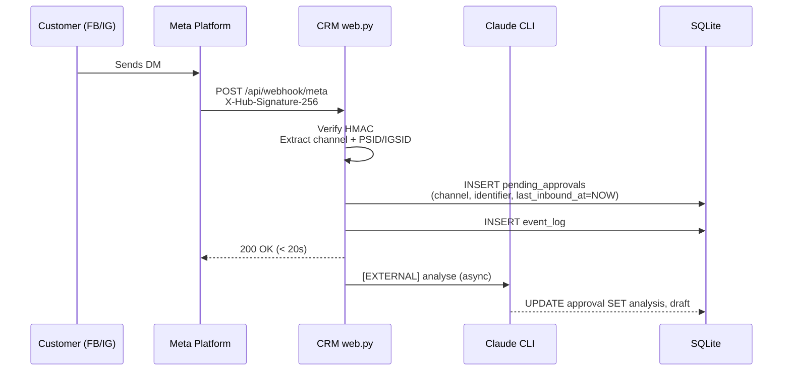
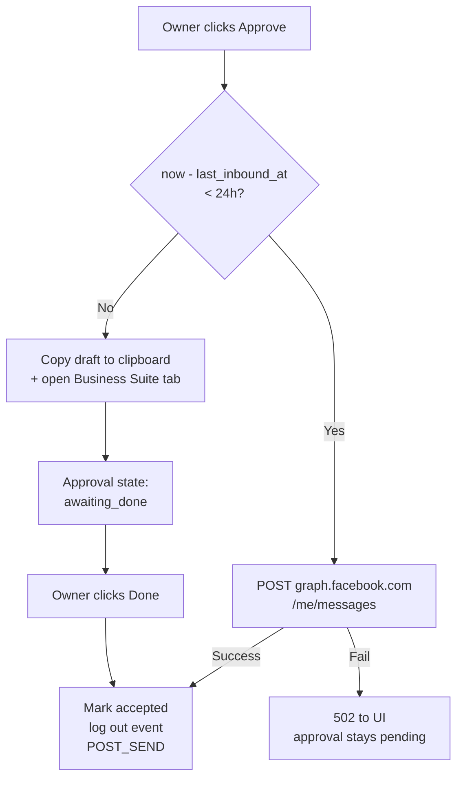

# feat: Official Messenger + Instagram connectors (hybrid send) with 24h SLA timer

## Overview

Add first-party Meta-channel connectors for **Facebook Messenger** and **Instagram Direct Messages**, so that customer DMs on those platforms flow into the existing approval queue and get the same AI-analysis + owner-approve treatment we already have for WhatsApp (Baileys) and the in-dashboard inbox.

Outbound is a **hybrid**:
- **Within Meta's 24h customer-service window** → one-click Graph API send
- **Outside the window** → an escape-hatch that copies the draft and opens the thread in Meta Business Suite / Instagram for the owner to paste manually, followed by a dashboard **Done** button that logs the send and fires POST_SEND

A countdown badge on each approval tells the owner how much of the 24h window is left, so urgent items are visually obvious without resorting the queue.

WhatsApp stays on the Baileys unofficial connector we already shipped; the official WhatsApp Cloud API path is intentionally hidden for now (revisit later when Meta Business Verification and App Review are done).

---

## Problem Frame

Today the CRM can receive messages from:
- Telegram (via `channels/telegram.py`)
- The in-dashboard "Submit" form (`POST /api/inbox/submit`)
- WhatsApp via the Baileys sidecar (`POST /api/webhook/whatsapp`)

Most SMB customers of this product actually talk to their customers through **Messenger and Instagram DMs**, not WhatsApp. Right now those conversations happen entirely outside the CRM — the owner copy-pastes between two apps, the AI never sees the context, contacts don't get auto-created, and the calendar doesn't capture scheduled actions that emerge from those chats.

Meta's official API is the only non-bannable way to integrate with FB Messenger and Instagram. But it has one sharp constraint: the **24h customer-service window** — you can only send free-form replies within 24 hours of the customer's last inbound message. Past that you need a pre-approved message tag or template, which is a meaningful additional build (and App Review surface).

For v1 we want to embrace the constraint rather than build around it: within window → real API send; outside window → clipboard-and-open fallback with a Done acknowledgment. That ships fast, requires a much narrower App Review submission, and still captures the conversation in the CRM either way.

---

## Requirements Trace

- **R1.** Tenant can connect their Facebook Page + linked Instagram Business account to the CRM via a single button in the dashboard (Facebook Login popup, no code).
- **R2.** Inbound Messenger DMs arrive in the Inbox tab automatically, tagged `channel=messenger`.
- **R3.** Inbound Instagram DMs arrive in the Inbox tab automatically, tagged `channel=instagram`.
- **R4.** The AI analyses each inbound message (same pipeline as the existing inbox submit) and drafts a reply.
- **R5.** When the conversation involves a new contact, the AI creates a new lead record in the wiki (same POST_SEND behavior as today).
- **R6.** When the conversation involves an existing contact, the AI updates their interaction log in the wiki.
- **R7.** Clicking Approve on a Messenger/Instagram approval where `(now - last_inbound_at) < 24h` sends the draft via Graph API and marks the approval accepted.
- **R8.** Clicking Approve on a Messenger/Instagram approval where `(now - last_inbound_at) >= 24h` copies the draft to the clipboard, opens the chat thread in Meta Business Suite / Instagram in a new tab, and surfaces a Done button on the approval card.
- **R9.** Clicking Done closes the manual-send loop: marks the approval accepted, logs the outbound event, runs POST_SEND.
- **R10.** Every approval for a channel subject to the 24h window shows a countdown badge (e.g. `18h 42m left`) that updates live. Badge turns red when under 2h remaining.
- **R11.** The existing WhatsApp flow (Baileys) remains the default for WhatsApp; no official WhatsApp connect button is exposed in v1.
- **R12.** Meta access tokens are encrypted at rest in SQLite (not stored in plaintext).
- **R13.** Meta webhook signature verification is enforced on every inbound request.

---

## Scope Boundaries

- Only **Facebook Messenger** and **Instagram DMs** from Meta are in scope.
- **WhatsApp** stays on Baileys; the official Cloud API path is intentionally out of scope for this plan.

### Deferred to Follow-Up Work

- **Message tags** (HUMAN_AGENT, CONFIRMED_EVENT_UPDATE, etc.): the official mechanism to send outside the 24h window. For v1 we use the clipboard escape-hatch instead, deferring the template/tag workflow entirely.
- **WhatsApp Cloud API (official connector)** including Embedded Signup, Business Verification flow, template management: separate future plan when a tenant hits the Baileys limits (bans, bulk outbound, or explicit template needs).
- **Instagram Stories replies**, **reactions**, **group Messenger chats**, **voice note transcription** on inbound: not supported in v1. Voice notes inbound from IG/Messenger surface as "[voice note]" placeholder, matching current WhatsApp handling.
- **Proactive outbound** (cold-DM initiation) on Messenger/Instagram: technically forbidden by Meta policy on these channels anyway. Compose flow stays web/WhatsApp-only.
- **Per-tenant Meta App registration.** One shared Chiefpa Meta App serves all tenants (Tech Provider pattern). Tenants only complete Facebook Login and Page selection. Individual tenants never touch the Meta App.

---

## Context & Research

### Relevant Code and Patterns

- `web.py` — FastAPI app, existing `/api/webhook/whatsapp` shows the exact webhook → pending_approval → `_analyse_inbox` pattern to mirror
- `web.py::accept_approval` (lines 178-~240) — the approval-accept state machine we already extended for WhatsApp send. Messenger/IG hybrid send logic extends this
- `db.py` — SQLite schema + helpers. Existing tables (`pending_approvals`, `event_log`) are the integration points; new tables (`channel_connections`, `message_threads`) to be added here
- `static/app.js::openWaModal` + `renderWaModal` — the QR-polling WhatsApp modal is the UX reference for the Connect Channel modal, except here the popup is Facebook Login instead of a polled QR
- `static/app.js::optimisticAction` — 5-second undo toast before commit; reuse for both auto-send and Done actions
- `channels/base.py` — abstract `BaseChannel` interface. The current webhook approach bypasses this, which is fine; we don't need to force new channels through the abstract interface just for consistency
- `CLAUDE.md` — AI instructions doc. Needs channel additions so `[EXTERNAL]` / `[POST_SEND]` handle `channel=messenger` and `channel=instagram`

### Institutional Learnings

- WhatsApp Baileys integration established the **sidecar-per-tenant** pattern + shared-secret webhook. Meta connectors do **not** need a sidecar — webhooks are inbound HTTP calls from Meta's servers to our FastAPI, and outbound is HTTPS calls to graph.facebook.com. Pure Python, in-process.
- The `wa.me/?text=` discovery (this session) confirms that WhatsApp has a first-party prefill URL scheme. Messenger and Instagram explicitly do not — Meta killed every prefill URL scheme years ago. This is why v1 uses clipboard + open-thread for the escape hatch, not a prefill URL.
- Existing cache-busting pattern: bump `v=N` on `app.js` and `style.css` query params after UI changes (currently at v=7)

### External References

- Meta Graph API v18.0 — `/PAGE_ID/messages` endpoint for Messenger send, same endpoint with `messaging_product=instagram` for IG
- Meta Webhooks v18.0 — signature header `X-Hub-Signature-256`, HMAC-SHA256 of raw request body with app secret
- Facebook Login for Business — `/dialog/oauth` with scopes `pages_messaging`, `pages_manage_metadata`, `pages_show_list`, `instagram_basic`, `instagram_manage_messages`, `business_management`
- Meta 24h Messaging Window reference: free-form text reply allowed within 24h of last customer inbound; after, only whitelisted message tags or templates

---

## Key Technical Decisions

- **One shared Meta App for all tenants (Tech Provider pattern).** Single app review cycle for both permissions; tenants only complete Facebook Login. Matches Meta's recommended architecture for B2B tools.
- **No sidecar for Meta channels.** Messenger/Instagram are straight HTTP webhooks and Graph API calls — native Python in `web.py`. Only WhatsApp kept the sidecar because Baileys needs a long-lived WebSocket.
- **Per-tenant token storage in SQLite, encrypted with Fernet.** A master key lives in an env var `TENANT_ENCRYPTION_KEY` set per tenant container. Decryption happens on-demand at send time, never cached in memory for long. Key rotation deferred to follow-up plan.
- **One `/api/webhook/meta` endpoint for both Messenger and Instagram.** Meta sends both channel events to the same app-level webhook; the `object` field of the payload (`page` vs `instagram`) routes to the right handler.
- **Last-inbound timestamp lives on the approval row, not the contact.** We compute window-remaining per-approval because that's what the UI cares about. If the customer replies again and re-opens the window, the *new* inbound creates a *new* approval with a fresh timestamp.
- **Window enforcement happens server-side in `accept_approval`, not client-side.** The client renders the countdown and the "Open to send manually" button, but the server re-checks the timestamp on accept — we never trust the client to decide which send path to take.
- **Escape-hatch deep-link targets Meta Business Suite inbox** (`business.facebook.com/latest/inbox`), not the native app. Desktop-first workflow matches the CRM's actual use context; mobile deep-links (`fb-messenger://`, `instagram://direct/`) are unreliable and device-specific. The owner lands in Business Suite with their inbox already open; they search for the contact and paste. Accept the friction — it's still less painful than not having the channel at all.
- **"Done" is a new approval state, distinct from "accepted".** Manual-send approvals transition `pending → awaiting_done → accepted`. A UI banner on the approval card explains what "Done" means so there's no ambiguity.
- **Countdown badge computed client-side from `last_inbound_at` timestamp.** Updates every 30 seconds via a shared interval. No server push needed.
- **Channel-agnostic AI pipeline — no CLAUDE.md forking per channel.** Same `[EXTERNAL]` / `[POST_SEND]` prompts, same wiki-update behavior. The only change to CLAUDE.md is adding `messenger` and `instagram` to the `channel` and `identifier_type` enums documented there.

---

## Open Questions

### Resolved During Planning

- **Replace Baileys or coexist?** → Coexist for now; Baileys stays default, official WhatsApp UI hidden (user decision).
- **Where does the 24h timer appear?** → Countdown badge on each approval card, chronological sort preserved (user decision).
- **Official send vs clipboard fallback?** → Hybrid: official API when in window, clipboard + open thread + "Done" button when out of window (user decision).
- **Single Meta App vs per-tenant?** → Single shared Chiefpa Meta App, tenants use Facebook Login — standard Tech Provider pattern.
- **Token storage?** → SQLite + Fernet application-level encryption with env-var key.
- **Deep-link target for escape hatch?** → Meta Business Suite inbox for desktop (primary workflow). Accept the "search for contact and paste" friction.

### Deferred to Implementation

- Exact Meta App review screencast script — we'll write the demo flow after the code works end-to-end.
- Whether to sort approvals by urgency later — user chose chronological for v1, but once real volume shows up we may want an opt-in "urgent first" toggle. Defer.
- Whether to auto-transition `awaiting_done` approvals to `expired` after some idle period (e.g. 48h with no Done click) — likely yes, but let's see real behavior before picking a threshold.
- Fernet key rotation story — deferred; v1 uses a static key per tenant.
- Behavior when a tenant has their IG/FB token revoked out-of-band (user un-links in Business Suite) — we'll detect the 190 / 200 error codes from Graph API on send and surface a reconnect banner, but exact copy + placement is an implementation detail.

---

## High-Level Technical Design

> *This illustrates the intended approach and is directional guidance for review, not implementation specification. The implementing agent should treat it as context, not code to reproduce.*

### Inbound flow



### Outbound — two paths gated by 24h window



### Approval state machine (extended)

```
        pending ────approve within 24h, API send──▶ accepted
           │                                           ▲
           │                                           │
           ├──approve outside 24h──▶ awaiting_done ────┘
           │                               ▲
           │                               │ (Done button)
           │
           └──reject──▶ rejected
```

---

## Implementation Units

- [ ] U1. **Database schema — channel_connections, message_threads, approval extensions**

**Goal:** Add persistent storage for per-tenant Meta tokens, thread-ID mappings (used by the escape-hatch deep-link), and new approval columns for SLA timer + manual-send state.

**Requirements:** R1, R7, R8, R9, R10, R12

**Dependencies:** None

**Files:**
- Modify: `db.py`
- Test: `tests/test_db_meta.py` (new)

**Approach:**
- New table `channel_connections`: `(id, channel, page_id, page_name, ig_business_account_id, access_token_encrypted, scopes, connected_at, last_validated_at, status)`. One row per connected channel per tenant (a tenant may have both Messenger and Instagram).
- New table `message_threads`: `(id, channel, identifier, thread_id, page_id, last_inbound_at, created_at)`. Thread ID is what the escape-hatch deep-link needs for Instagram; for Messenger it's the PSID we already have.
- Extend `pending_approvals` with two new columns via `ALTER TABLE` migration (pattern matches the existing `kind` migration in `db.py::init_db`):
  - `last_inbound_at TEXT` — ISO-8601 timestamp, the anchor for the 24h countdown
  - `manual_send_state TEXT DEFAULT NULL` — enum `NULL | 'awaiting_done'`
- Helper functions: `save_channel_connection`, `get_channel_connection`, `delete_channel_connection`, `upsert_message_thread`, `get_message_thread`.
- Fernet encryption/decryption helpers read `TENANT_ENCRYPTION_KEY` from env; fail loud if missing.

**Patterns to follow:**
- `db.py::init_db` — executescript idempotent CREATE TABLE + ALTER TABLE try/except for columns
- `db.py::create_calendar_event` pattern for new CRUD helpers

**Test scenarios:**
- Happy path: `save_channel_connection('messenger', page_id='123', token='abc')` stores row, `get_channel_connection('messenger')` returns it with token decrypted
- Happy path: `upsert_message_thread` on first call inserts, on second call with same (channel, identifier) updates `last_inbound_at` without creating a duplicate
- Edge case: `get_channel_connection('instagram')` on empty DB returns None, not raise
- Edge case: `last_inbound_at` column added by migration to pre-existing DB without losing existing rows (simulate by loading a DB file generated by the current schema, then running `init_db`, then reading back rows)
- Error path: decrypting a token with the wrong `TENANT_ENCRYPTION_KEY` raises (does not silently return garbage)
- Error path: init_db fails loudly if `TENANT_ENCRYPTION_KEY` env var is missing

**Verification:**
- `python -c "import db; db.init_db(); print('ok')"` runs against a fresh and an existing DB, both produce no errors
- Schema inspection: `sqlite3 data/crm.db ".schema"` shows both new tables and the two new columns on `pending_approvals`

---

- [ ] U2. **Meta webhook receiver: /api/webhook/meta**

**Goal:** A single FastAPI endpoint that accepts Meta's verification handshake (GET) and inbound message events (POST), validates signatures, and dispatches by payload type.

**Requirements:** R2, R3, R13

**Dependencies:** U1

**Files:**
- Modify: `web.py` (new route group)
- Test: `tests/test_meta_webhook.py` (new)

**Approach:**
- `GET /api/webhook/meta`: Meta verification handshake. Compare `hub.verify_token` query param against env `META_VERIFY_TOKEN`; echo `hub.challenge` on match, 403 otherwise.
- `POST /api/webhook/meta`: Validate `X-Hub-Signature-256` HMAC-SHA256 against the raw request body using `META_APP_SECRET`. Dispatch by `payload.object`:
  - `object == 'page'` → Messenger handler
  - `object == 'instagram'` → Instagram handler
  - otherwise → log and 200 (Meta retries 4xx, we don't want to cause retries on unknown event types)
- Return 200 within the Meta timeout (~20s). Kick off `_analyse_inbox` via `asyncio.create_task` so we respond before AI finishes.
- Raw body required for signature validation — use `await req.body()` before parsing JSON.

**Patterns to follow:**
- `web.py::wa_webhook` — existing shared-secret check and async task kickoff
- FastAPI raw-body access via `Request.body()`

**Test scenarios:**
- Happy path: GET with correct verify token echoes challenge
- Happy path: POST with valid signature + Messenger payload creates approval, returns 200 in <500ms
- Happy path: POST with valid signature + Instagram payload creates approval, returns 200 in <500ms
- Edge case: POST with payload for unknown `object` value returns 200, does not create approval, logs warning
- Edge case: payload with multiple `entry[].messaging[]` items creates multiple approvals (Meta batches)
- Error path: GET with wrong verify token → 403
- Error path: POST with missing signature header → 403
- Error path: POST with wrong signature → 403, no approval created
- Error path: POST with malformed JSON after valid signature → 400, no approval created
- Integration: async analyse task fires and updates the approval row with `analysis` / `draft` within 30s (mock Claude CLI to return canned output)

**Verification:**
- `curl` GET with verify token returns challenge
- `curl` POST with a crafted HMAC-signed Messenger sample payload creates an approval visible via `GET /api/approvals`

---

- [ ] U3. **Inbound ingestion: Messenger + Instagram → approval queue**

**Goal:** Parse Messenger/Instagram webhook payloads into the shape `_analyse_inbox` expects, upsert thread mappings, and enqueue analysis. Single handler shared between the two channels since the payload shapes are 95% identical.

**Requirements:** R2, R3, R4, R5, R6, R10

**Dependencies:** U1, U2

**Files:**
- Modify: `web.py` (handler functions called from U2's dispatcher)
- Test: `tests/test_meta_ingest.py` (new) — fixture payloads for both channels

**Approach:**
- Function `_ingest_meta_message(channel, payload, page_id)`:
  - Extract `sender.id` (PSID for Messenger, IGSID for Instagram) → use as `identifier`
  - Extract `message.text` → `text`
  - Handle `message.attachments` → placeholder strings ("[image]", "[video]", etc.), matching the Baileys sidecar's current behavior
  - Resolve sender display name: Messenger supports `/user-id?fields=name`; Instagram does not expose user profile in basic scope. For Instagram, fall back to `@<username>` if surfaced in the payload, else the raw IGSID.
  - `db.upsert_message_thread(channel, identifier, thread_id, page_id, last_inbound_at=now)`
  - Create approval with `channel`, `identifier`, `identifier_type=channel`, `last_inbound_at=now`
  - Skip echoes (`message.is_echo == True`) — these are Meta replaying the business's own sends
- Identifier format: IGSIDs and PSIDs are numeric strings. Store as-is; the AI sees the raw ID. The wiki lookup is fuzzy anyway (identifier is searched against `_INDEX.md` rows).

**Patterns to follow:**
- `web.py::wa_webhook` lines ~660-700 — creates approval, kicks async analyse task

**Test scenarios:**
- Happy path: Messenger payload with text-only message creates approval with `channel=messenger`, `identifier_type=messenger`, `last_inbound_at` set
- Happy path: Instagram payload with text-only message creates approval with `channel=instagram`
- Edge case: Messenger echo (`is_echo: true`) → skipped, no approval
- Edge case: attachment-only Messenger message → approval with `text='[image]'` placeholder
- Edge case: message with text AND attachment → text is used, attachment noted in bracket
- Edge case: same customer sends 3 messages in quick succession → 3 approvals, thread's `last_inbound_at` ends at the latest timestamp (upsert behavior verified)
- Error path: sender display name lookup fails (network/timeout) → approval created with identifier-only sender_name, does not block ingestion
- Integration: AI analysis fires via the same `_analyse_inbox` used by in-dashboard submits and produces a draft with the `[EXTERNAL]` prompt format

**Verification:**
- Synthetic Messenger + Instagram payloads ingested end-to-end produce approvals with correct channel tags visible in the Inbox tab
- Wiki lookup continues to work for channels we've taught the AI about (U9)

---

- [ ] U4. **Facebook Login + OAuth callback**

**Goal:** Backend for the "Connect Messenger / Instagram" button: serves the OAuth callback, exchanges the short-lived token for a long-lived Page access token, subscribes the Page to our webhook, and stores the result.

**Requirements:** R1, R12

**Dependencies:** U1

**Files:**
- Modify: `web.py` (new route group `/api/channels/meta/*`)
- Test: `tests/test_meta_oauth.py` (new)

**Approach:**
- `GET /api/channels/meta/login-url` → returns the Facebook Login dialog URL with all required scopes and a state parameter (CSRF token stored in `pending_approvals`-adjacent short-lived table, or signed JWT — pick signed JWT to avoid another table).
- `GET /api/channels/meta/callback?code=...&state=...`:
  - Validate state
  - Exchange `code` for short-lived user access token (Graph API `/oauth/access_token`)
  - Exchange short-lived user token for long-lived user token (60-day)
  - List the user's Pages (`/me/accounts`) — take the first if one, else return Page list to frontend for picker
  - Get the Page access token (included in `/me/accounts` response per page)
  - For the selected Page, subscribe it to our app's webhook (`POST /PAGE_ID/subscribed_apps`)
  - If Instagram connected, discover `instagram_business_account.id` from `/PAGE_ID?fields=instagram_business_account`
  - Encrypt the Page access token, save via `db.save_channel_connection`
  - Redirect back to dashboard with `?connected=<channel>` query param
- `GET /api/channels/meta/status` → returns `[{channel, page_name, connected_at, status}]` for the connect modal
- `POST /api/channels/meta/disconnect` → deletes the stored connection + calls `DELETE /PAGE_ID/subscribed_apps` to cleanly unsubscribe

**Patterns to follow:**
- `web.py::wa_connect` / `wa_disconnect` — the WhatsApp modal's connect/disconnect semantics are the closest UX analogue; reuse the state-response shape for consistency
- `requests` library already in `requirements.txt`

**Test scenarios:**
- Happy path: callback with valid code + state saves encrypted token, returns redirect
- Happy path: Page list with multiple pages returns picker data to frontend (status=picking)
- Edge case: tenant connects Messenger first, then connects Instagram later — second call doesn't overwrite first, both rows exist in `channel_connections`
- Edge case: tenant reconnects (already has a connection for the channel) — upsert, not duplicate insert
- Error path: callback with mismatched state → 403, no save
- Error path: Graph API returns error on token exchange → surface as 502 with detail, no partial save
- Error path: Page subscription call fails → rollback the token save (compensating delete)
- Error path: invalid / expired code → 400 with detail
- Integration: end-to-end with a live Meta test app (manual, not automated) — clicking connect in UI → popup → picking Page → lands back on dashboard with banner "Messenger connected"

**Verification:**
- A test Meta app + a test FB account completes the full connect flow; resulting `channel_connections` row has a valid, Fernet-encrypted token that actually works for a send test

---

- [ ] U5. **Outbound send — within 24h window (Graph API)**

**Goal:** When an approval is accepted and the 24h window is still open, send via Meta Graph API. Handles both Messenger and Instagram.

**Requirements:** R7, R9

**Dependencies:** U1, U3, U4

**Files:**
- Modify: `web.py::accept_approval` (extend, don't rewrite)
- Test: `tests/test_accept_meta.py` (new)

**Approach:**
- Extend `accept_approval`: after the existing WhatsApp branch, add `if approval['channel'] in ('messenger', 'instagram')`:
  - Check `(now - last_inbound_at) < 24h`. If expired → raise `HTTPException(409, 'outside_window')` — U6 handles this branch on the client side
  - Load connection token (`db.get_channel_connection(channel)`), decrypt
  - POST to `https://graph.facebook.com/v18.0/me/messages` with:
    - For Messenger: `{recipient: {id: PSID}, message: {text}, messaging_type: 'RESPONSE', access_token: ...}`
    - For Instagram: same payload + `messaging_product: 'instagram'`
  - On 2xx: proceed with existing `status=accepted` + log + POST_SEND
  - On 4xx/5xx: raise 502 with detail from Meta error response, approval stays pending
- Treat Meta error codes 190 / 200 (invalid/expired token) specially: mark the connection row `status='needs_reconnect'` so the UI can surface a banner

**Patterns to follow:**
- `web.py::accept_approval` WhatsApp branch (lines ~195-225) — the send-then-mark-accepted order, 502 on failure, approval stays pending for retry

**Test scenarios:**
- Happy path: accept a messenger approval at t=1h after inbound → POST to Graph API happens, returns 2xx, approval marked accepted
- Happy path: accept an instagram approval at t=5h → same, with `messaging_product=instagram` in payload
- Edge case: accept at exactly t=23h59m → still sends via API (under 24h)
- Edge case: accept at t=24h01m → returns 409 `outside_window`, no API call, approval stays pending
- Error path: Graph API returns 400 "Unsupported Post Request" → 502 to UI, approval stays pending
- Error path: Graph API returns error code 190 (invalid token) → 502 to UI, connection row flipped to `needs_reconnect`
- Error path: Graph API network timeout → 502, approval stays pending
- Integration: successful send produces outbound `event_log` entry AND triggers POST_SEND (verified by checking the wiki file for an appended interaction log row)

**Verification:**
- Manual: real FB test account accepts a messenger test message — the customer receives the reply within seconds
- Mock: unit test with mocked `requests.post` asserts the exact payload shape hits Graph API

---

- [ ] U6. **Outbound escape-hatch — outside 24h window (copy + deep-link + Done)**

**Goal:** When the window has closed, the Approve button flow copies the draft to clipboard, opens the thread in Meta Business Suite, and surfaces a "Done" button on the approval card. Clicking Done closes the loop.

**Requirements:** R8, R9

**Dependencies:** U1, U5

**Files:**
- Modify: `static/app.js::acceptApproval`, `openApproval` (approval panel renderer), `renderApprovalCard`
- Modify: `web.py` — new endpoint `POST /api/approvals/{id}/done`
- Modify: `static/index.html` (bump cache version to v=8)
- Test: `tests/test_accept_done.py` (new)

**Approach:**
- Client-side logic on Approve click for `channel in ('messenger', 'instagram')`:
  - Check local `last_inbound_at` against now
  - If `< 24h` → current path (call `/accept`)
  - If `>= 24h`:
    - `navigator.clipboard.writeText(draft)`
    - `window.open('https://business.facebook.com/latest/inbox', '_blank')` (or the Instagram-specific path if we can resolve a thread link — see below)
    - Call `POST /api/approvals/{id}/mark-awaiting-done` → server sets `manual_send_state='awaiting_done'`, does NOT mark accepted yet
    - Approval panel + card flip to "Awaiting send" state: yellow banner, explanatory text ("Paste the copied message in the thread, then click Done."), single **Done** button
- Server endpoint `POST /api/approvals/{id}/done`:
  - Only accepts approvals with `manual_send_state='awaiting_done'`
  - Marks `status=accepted`, logs outbound event, runs POST_SEND (same downstream actions as the auto-send path)
- Instagram deep-link: try `https://www.instagram.com/direct/t/<thread_id>/` first if we have a stored thread ID, else fall back to `https://business.facebook.com/latest/inbox`. Don't invent URLs that don't work — fall back cleanly.
- Idempotency: if the owner clicks Done twice, the second call is a no-op (already accepted).

**Patterns to follow:**
- `static/app.js::optimisticAction` — 5-second undo toast on Done, same as send

**Test scenarios:**
- Happy path: approve an out-of-window messenger approval → clipboard contains draft, new tab opens to Business Suite inbox, approval card shows Done button, server state is `awaiting_done`
- Happy path: click Done → approval marked accepted, event logged, POST_SEND runs
- Edge case: approval with `last_inbound_at` exactly at 24h00m boundary → client takes auto-send path (boundary-inclusive in U5 server-side check)
- Edge case: owner closes the tab without sending; comes back next day; clicks Done anyway → approval accepted. This is acceptable — we trust the owner's assertion
- Edge case: owner double-clicks Done → second call returns 200 with `already_accepted` status, no duplicate events
- Edge case: clipboard API blocked (non-HTTPS context, browser prompt denied) → show toast "Please copy manually" + still open the tab + still show Done button
- Error path: Done called on an approval that was never marked `awaiting_done` (e.g. direct API call) → 400 with detail
- Error path: Done called on already-rejected approval → 400 with detail
- Integration: end-to-end with real account — owner approves out-of-window IG message, tab opens, they paste and send in Instagram, come back, click Done, wiki interaction log row appears

**Verification:**
- Real test account with an out-of-window approval: click approve → clipboard populated, Business Suite opens, Done flow completes cleanly

---

- [ ] U7. **Connect Channel dashboard modal**

**Goal:** Frontend surface for U4. Header button opens a modal listing Messenger + Instagram with Connect/Disconnect controls and connection state.

**Requirements:** R1, R11

**Dependencies:** U4

**Files:**
- Modify: `static/index.html` — new header button `#hsChannels`, new modal `#channelsModal`
- Modify: `static/app.js` — new handlers, reuse polling pattern from WhatsApp modal
- Modify: `static/index.html` cache version bump (v=8)

**Approach:**
- Header pill next to WhatsApp one: "🔗 Channels" with a count badge showing how many are connected
- Modal lists three rows: Messenger, Instagram, WhatsApp (via Baileys, read-only — "Connected via WhatsApp Web"). Messenger and Instagram each have a Connect button that opens the Facebook Login popup via `window.open(loginUrl, '_blank', 'width=600,height=700')`
- When a connection completes, the callback redirects to `/?connected=messenger`. On page load, detect the query param and flash a success toast + refresh the modal state
- Per R11: **do not** show an "official WhatsApp" row. WhatsApp stays on the Baileys card.

**Patterns to follow:**
- `static/app.js::openWaModal` — modal open/close/poll pattern, header pill state updates
- `static/index.html` activity-modal / overlay conventions

**Test scenarios:**
- Happy path: click Channels → modal opens, shows both FB/IG as not connected + WhatsApp as connected (if Baileys session active)
- Happy path: click Connect Messenger → popup opens to FB Login URL
- Happy path: URL has `?connected=messenger` on page load → toast fires, modal shows Messenger as connected with Page name
- Edge case: popup blocked by browser → show inline message "Enable popups and try again"
- Edge case: tenant has both Messenger and Instagram connected → modal shows both with disconnect options
- Integration: connect flow end-to-end with a real test account
- No-behavior test expectation: none — this is primarily UI glue; visual verification covers it

**Verification:**
- Live modal shows the correct state after connection; disconnect actually removes the row from `channel_connections` and unsubscribes the Page

---

- [ ] U8. **24-hour countdown badge on approval cards**

**Goal:** Each approval for a 24h-windowed channel shows a live countdown. Turns red when under 2h remaining.

**Requirements:** R10

**Dependencies:** U1

**Files:**
- Modify: `static/app.js` — `renderApprovalCard`, new helper `formatWindowRemaining(last_inbound_at)`
- Modify: `static/index.html` — CSS for the badge classes (`.win-ok`, `.win-warn`, `.win-urgent`, `.win-expired`)
- No test file — pure UI render, verified visually

**Approach:**
- Helper `formatWindowRemaining(ts)`:
  - Returns `{label, cls}` where label is e.g. `18h 42m` and cls is one of `win-ok` (>6h), `win-warn` (2-6h), `win-urgent` (<2h), `win-expired` (past 24h)
- Added to the approval card header row, only for channels in `['whatsapp', 'messenger', 'instagram']` (WhatsApp shows it too — even though Baileys doesn't technically enforce a window, the business value of "how long since they messaged me" is the same signal)
- Global 30-second interval re-renders all visible badges. When a badge expires (past 24h), it flips to `win-expired` color + label `expired`; the Approve button's behavior on click switches to the U6 manual-send path automatically (state already kept server-side)

**Patterns to follow:**
- `static/app.js::time_ago` helper in `web.py` for the relative-time formatting convention

**Test scenarios:**
- `formatWindowRemaining(now - 1h)` returns `{label: '23h 0m', cls: 'win-ok'}`
- `formatWindowRemaining(now - 22.5h)` returns `{label: '1h 30m', cls: 'win-urgent'}`
- `formatWindowRemaining(now - 23h50m)` returns `{label: '10m', cls: 'win-urgent'}`
- `formatWindowRemaining(now - 25h)` returns `{label: 'expired', cls: 'win-expired'}`
- `formatWindowRemaining(null)` → no badge (non-windowed channel)
- Integration: an approval rendered at t=1h shows 23h remaining; after mocking Date.now() +2h, re-render shows 21h remaining

**Verification:**
- Visual: approval cards show the badge in the correct color at the correct times
- Playwright or manual: open an approval at `last_inbound_at = 23h ago`, wait 2 minutes, badge decrements

---

- [ ] U9. **AI instruction updates: Messenger + Instagram channels in CLAUDE.md**

**Goal:** Teach the AI to recognize and handle `channel=messenger` and `channel=instagram` throughout the [EXTERNAL] / [POST_SEND] flows. Contact create/update logic is unchanged — the channel is just another string to match.

**Requirements:** R4, R5, R6

**Dependencies:** None (docs-only, but affects U3 and U5/U6 runtime behavior via prompts)

**Files:**
- Modify: `CLAUDE.md`

**Approach:**
- Update the "Message Types" intro — mention IG/Messenger as valid channels
- Update the `identifier_type` enum documentation: add `messenger` (PSID) and `instagram` (IGSID)
- In the [EXTERNAL] Step 1 — Identify the sender:
  - Add instruction: for `identifier_type in (messenger, instagram)`, the identifier is a numeric ID the customer can't see; try to match by `sender_name` first, fall back to creating a new lead with the ID as fallback identifier
- In the [POST_SEND] flow:
  - Update the "Update DB" code block's channel example list to include `messenger | instagram | whatsapp | telegram | email`
  - Same for the lead file format's `Identifier Type` list
- No change to calendar-event rules — they already use `client_identifier` channel-agnostically

**Patterns to follow:**
- Existing CLAUDE.md structure — don't restructure, just additive

**Test scenarios:**
- Test expectation: none — this is prompt engineering, verified by observing AI behavior in integration tests (U3 integration test covers it by asserting the AI's output identifies the sender correctly for IG/Messenger)

**Verification:**
- Send a Messenger test message from a known contact's FB account → AI analysis identifies them from the wiki, draft references their name
- Send a Messenger test message from an unknown account → AI analysis says "new contact — will be created on send"; after accepting, a lead file exists in the wiki

---

- [ ] U10. **Fernet encryption + TENANT_ENCRYPTION_KEY env plumbing**

**Goal:** Encrypt Meta access tokens at rest. Key is per-tenant, injected via env var by docker-compose.

**Requirements:** R12

**Dependencies:** None (prerequisite for U1 helpers to work)

**Files:**
- Modify: `db.py` — add `_encrypt(text)` / `_decrypt(text)` helpers
- Modify: `requirements.txt` — add `cryptography`
- Modify: `docker/docker-compose.template.yml` — add `TENANT_ENCRYPTION_KEY` to both `crm` service env (generated at provision time)
- Modify: `docker/provision.sh` — generate a Fernet key `python -c "from cryptography.fernet import Fernet; print(Fernet.generate_key().decode())"` and substitute into compose
- Modify: `web.py` — fail-fast check at startup that the key is present and valid
- Test: covered by U1 tests (round-trip encrypt/decrypt)

**Approach:**
- `_encrypt(text)` returns urlsafe-base64 ciphertext; `_decrypt(ciphertext)` returns text.
- Key loaded at module load time from env; raise at import if missing OR if malformed (Fernet validates its own key shape).
- Existing tenants: provision script adds the var to their compose file, restart to pick it up. Their DB won't have any encrypted data yet, so no migration needed — first token save happens against the new key.

**Patterns to follow:**
- `whatsapp-sidecar`'s per-tenant webhook secret generation in `docker/provision.sh` — mirror that exactly

**Test scenarios:**
- Happy path: round-trip — encrypt "secret", decrypt, get "secret" back
- Edge case: empty string round-trips
- Edge case: unicode string round-trips
- Error path: decrypt with a different key raises `InvalidToken`
- Error path: missing env var raises at import with a clear message

**Verification:**
- Existing tenants restart cleanly after the compose update
- A test Meta connection stores a token that inspecting `sqlite3 crm.db` shows is NOT plaintext

---

## System-Wide Impact

- **Interaction graph:** The `accept_approval` flow gains two new branches (Messenger/IG in-window, Messenger/IG out-of-window). The `POST_SEND` prompt fires identically for all three paths (auto-send, Done-after-manual-send, existing WhatsApp/web send). The wiki/calendar downstream effects are unchanged.
- **Error propagation:** Graph API failures on send surface as 502 with `detail` extracted from Meta's error response. Token-expired errors (code 190) additionally flip the connection's `status='needs_reconnect'` so the dashboard can banner it. Webhook signature mismatches fail closed (403) — we don't want to silently accept suspicious inbound.
- **State lifecycle risks:** The new `manual_send_state='awaiting_done'` is a halfway state. If the owner never clicks Done, the approval sits in `awaiting_done` indefinitely. For v1 this is acceptable (no auto-expire). Worth watching once real usage shows up — see Deferred Questions.
- **API surface parity:** The new approval state machine (pending → awaiting_done → accepted) is visible to anyone consuming `/api/approvals`. Update any docs / external scripts that consume it.
- **Integration coverage:** Real end-to-end tests with a live FB test account are required for U4 (OAuth), U5 (send), and U6 (escape hatch). Mocked unit tests cover the shape but not the Meta-side behavior.
- **Unchanged invariants:** The Baileys WhatsApp sidecar and its wiring stay exactly as shipped. The existing `/api/webhook/whatsapp` endpoint, the WhatsApp Connect modal, and the `channel='whatsapp'` send path in `accept_approval` are untouched.

---

## Risks & Dependencies

| Risk | Likelihood | Impact | Mitigation |
|------|-----------|--------|------------|
| Meta App Review rejects `instagram_manage_messages` / `pages_messaging` requests | Medium | High — ships late | Screencast a clear use case (tenant responding to inbound customer messages, same pattern as WhatsApp plan); submit both permissions in one submission to share review overhead; keep the Baileys WhatsApp path working so tenants have *something* while approval pending |
| Meta Business Suite deep-link URL format changes (out-of-window escape hatch breaks) | Low | Medium — owner can still paste into the platform directly | The button is a convenience; even if the link drops them at the inbox root, the clipboard still has the draft. Monitor Meta's doc changes; add a "Page not loading?" fallback link |
| Tenant's FB token gets revoked out-of-band (they un-link the app in FB settings) | Medium | Medium — sends fail until they reconnect | Detect error codes 190/200 on send; mark connection `needs_reconnect`; dashboard shows a banner prompting to reconnect. Covered in U5 |
| 24h window calculation drift (client-side badge vs server-side accept check disagree at the boundary) | Low | Low — worst case is one "approve" click that 409s and forces the escape-hatch path | Server always re-validates on accept. Client never assumes. |
| Fernet key loss (tenant's compose file is lost / rebuilt without preserving the env var) | Low | High — stored tokens become unrecoverable | Document the key backup in ops notes. Losing the key is equivalent to needing to reconnect all channels — not catastrophic at our scale. Consider central key escrow later |
| Inbound webhook burst overwhelms analyse queue (tenant with active campaign gets 50 DMs at once) | Low | Medium — approvals pile up as "Analysing..." until Claude CLI catches up | `asyncio.create_task` is fire-and-forget; Claude CLI is single-process per tenant. At scale, add a proper queue/worker. For v1, accept — SMB volume is low |
| Meta deprecates v18.0 Graph API mid-build | Low | Medium — swap version string | Keep the Graph version in a single config constant (`META_GRAPH_VERSION='v18.0'`); swap later as needed |
| Outbound message fails silently (Graph API 200 but message not delivered to customer) | Low | Medium | Meta's webhook sends `message_delivery` events we could consume; defer to follow-up unless observed in practice |

---

## Documentation / Operational Notes

- **Meta App setup runbook** (to be written before App Review submission): step-by-step for creating the Chiefpa Meta App in Meta Business Manager, adding products (Webhooks, Messenger, Instagram Basic Display / Graph API), filling in privacy policy + terms URLs, configuring the webhook subscription URL and verify token.
- **App Review submission** bundles three permissions in one screencast:
  - `whatsapp_business_messaging` (for the future WhatsApp Cloud API connector — even though v1 hides the UI, it's cheaper to review all three together than two now and one later)
  - `pages_messaging`
  - `instagram_manage_messages`
- **Per-tenant onboarding**: new tenants now see three channel options in the Channels modal (Messenger, Instagram, WhatsApp-via-Baileys). No code required on their end.
- **Monitoring**: log every Graph API call with the response status + Meta-error-code if present. Add to the existing `event_log` table (new event types: `meta_send_success`, `meta_send_fail`, `meta_webhook_received`).
- **Rollout**: ship behind a tenant-level flag (`config.json → features.meta_channels = true`) so we can enable per-tenant during beta, then flip globally once the App Review completes.

---

## Sources & References

- Prior WhatsApp integration (this repo, commit `b00dddd`) — the Baileys sidecar, its webhook pattern, and the accept_approval send-first-mark-second design are the primary reference implementations
- Prior design conversation (current session) — captured in the chat transcript; the `wa.me` discovery and the hybrid-send pivot originated there
- Meta Graph API docs: `https://developers.facebook.com/docs/graph-api/reference/v18.0/page/messages`
- Meta Messenger Platform 24h window: `https://developers.facebook.com/docs/messenger-platform/policy/policy-overview/`
- Meta Instagram Messaging API: `https://developers.facebook.com/docs/messenger-platform/instagram/`
- Meta Webhook signature verification: `https://developers.facebook.com/docs/graph-api/webhooks/getting-started#validate-payloads`
- Meta Business Login for Business (OAuth): `https://developers.facebook.com/docs/facebook-login/guides/access-tokens/`

---

## Deferred Follow-Up Plans

After this plan ships:
1. **Official WhatsApp Cloud API connector** — triggered when a tenant hits Baileys limits (bans, wants templates, wants proactive outbound)
2. **Message tags** for Messenger/Instagram — eliminates the clipboard escape-hatch for the most common out-of-window cases (appointment reminders → CONFIRMED_EVENT_UPDATE)
3. **Webhook `message_delivery` events** — confirm customer actually received outbound; surface undelivered messages
4. **Proper queue/worker** for analyse if tenant volume grows past ~100 DMs/day
5. **Fernet key rotation** story + backup/escrow
