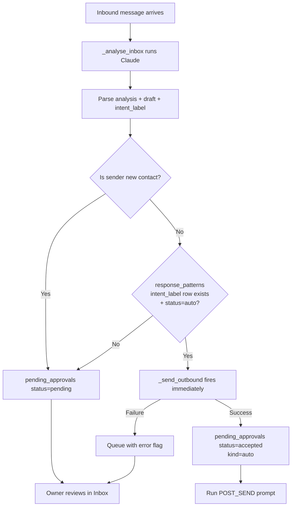

# feat: Auto-approval of repeat Q&A patterns

## Overview

Today every customer message lands in the Inbox as a pending approval and the owner has to click approve (or edit + approve) on each one. That's fine when they have 3 conversations a day — untenable at 30+. This plan builds a system that learns: when the owner has approved the same *type* of question → *type* of answer enough times without edits, we offer to auto-approve future messages of that type. Once enabled, those messages skip the queue entirely and the reply fires immediately.

The value compounds: the more the owner uses the product, the less work the product asks of them. It's also the hinge that makes cross-tenant learnings meaningful later — patterns are the unit of accumulated knowledge.

---

## Problem Frame

**Owner pain today:** every WhatsApp / Messenger / Instagram / form-submit message creates a pending approval. For an AC-servicing business getting 10+ "what's your price for a 2HP install?" queries a week, every one is:
1. Customer sends → we analyse → draft lands in Inbox
2. Owner reads it, sees it's the same reply they've sent 8 times
3. Owner clicks approve → sent

Steps 2-3 are pure toil. The owner has already *proved* (by approving without edits repeatedly) that they trust the draft for this type of question. We should promote that trust to automation.

**What "same type" means:** not string-match. "How much for 2HP install?" and "Price for 2-ton aircond installation?" should resolve to the same intent. The AI is the right classifier — it already reads each message with wiki context to draft a reply; teaching it to also *label* the intent is a small marginal ask.

**Why now:**
- Baileys WhatsApp + Meta Messenger/Instagram have landed. Volume per tenant is about to climb meaningfully.
- Auto-approval is the most-requested compound-value feature the owner brought up unprompted.
- The pattern layer is a prerequisite for several deferred items (nightly hygiene sweep can use pattern data; cross-tenant learnings need patterns to aggregate).

---

## Requirements Trace

- **R1.** Each inbound message gets an **intent label** from the AI at analysis time.
- **R2.** Track per-intent statistics: how many approvals, how many edited, how many rejected, distinct days.
- **R3.** After **5 accepted + zero-edit + zero-reject occurrences spread across 5 distinct days in a rolling 30-day window**, surface the intent as "eligible to automate" in a Settings UI.
- **R4.** Owner can enable auto-approval per intent (explicit action, never default).
- **R5.** When auto-approval is on for an intent, matching inbound messages skip the queue: draft is built, sent via the appropriate channel, and POST_SEND fires — all without owner interaction.
- **R6.** Owner can view / enable / disable / revert patterns in a Settings panel.
- **R7.** Safety rails:
  - **R7a.** Never auto-approve if the sender is a new (unknown) contact — lead creation always requires owner eyes.
  - **R7b.** Circuit breaker: if the owner later flags an auto-sent reply as wrong, the pattern reverts to `manual_locked` (blocked from re-promotion without owner re-enablement).
  - **R7c.** Staleness: if a pattern has zero occurrences in the rolling 30-day window, status decays back to `learning` until fresh instances accumulate again.
- **R8.** Auto-sent messages still produce `event_log` entries with direction='out' and event_type='auto_sent' for auditability.
- **R9.** Changes to wiki files consulted by a pattern's approvals don't auto-invalidate in v1 — deferred (see Scope). Owner revert is the only safety net for now.

---

## Scope Boundaries

- **No embedding-based similarity search.** Intent matching is exact-string match on the AI-generated label. The AI is responsible for consistent labelling (prompted with known labels).
- **No wiki-file-change invalidation.** Tracking which wiki files each draft read, and invalidating patterns when those files change, is deferred. Owner revert is the escape hatch for v1.
- **No adversarial-prompt detection.** If a customer crafts a message specifically to trigger an auto-approved intent, we don't detect that. The AI's labelling granularity is our first-line defence (see R1 — AI should choose a narrower label when qualifiers differ).
- **Single-tenant scope.** Each tenant's patterns are isolated to their own SQLite DB. No cross-tenant learning in v1.
- **No tunable thresholds in UI.** `MIN_OCCURRENCES=5`, `MIN_DISTINCT_DAYS=5`, `ROLLING_WINDOW_DAYS=30` are hardcoded constants. Could be surfaced later if owner feedback warrants.
- **Compose flow stays owner-driven.** Proactive outbound (the `[COMPOSE]` path) always requires approval. Only responses to inbound get auto-approval.

### Deferred to Follow-Up Work

- **Wiki-change invalidation**: track `wiki_files_used` per draft, auto-demote patterns when those files change. Requires AI reporting + git-diff watching.
- **Cross-tenant pattern sharing**: once patterns stabilise within a tenant, aggregate anonymised patterns to seed new tenants. Separate plan when it's time.
- **Thumbs-up / quality rating**: "approve + this was perfect" gives a cleaner positive signal than "approve" alone. Worth adding once we have pattern data to compare against.
- **Pattern view UI with history**: show every past occurrence for an intent so the owner can review before promoting. For v1, show just a canonical example.
- **Stats-driven tenant insights**: once patterns accumulate, dashboard showing "You've saved X clicks this month from auto-approval" etc. Growth lever, not v1.

---

## Context & Research

### Relevant Code and Patterns

- `web.py::_analyse_inbox` — the current inbound-to-approval funnel. All channels (web submit, WhatsApp webhook, Meta webhook) flow through here. This is where intent extraction + auto-send bypass live.
- `web.py::accept_approval` — the orchestrator we extended for WhatsApp + Meta send paths. Auto-send needs to reuse the same send dispatch, factored out.
- `web.py::_send_outbound` would be the natural home — but per the cleanup plan (U5 in `2026-04-23-002-refactor-audit-and-cleanup-backlog-plan.md`) this hasn't been extracted yet. This plan either:
  - (a) extracts it in U6 of this plan as a prerequisite; or
  - (b) duplicates the dispatch inline and accepts the debt.
  - **Decision: option (a)** — we were going to do it anyway; better to do it now while it's one refactor instead of two.
- `db.py` migration pattern (`try: ALTER TABLE; except sqlite3.OperationalError: pass`) — idempotent, matches existing style.
- `CLAUDE.md` `[EXTERNAL]` output format uses marker blocks like `*📋 ANALYSIS*` and `===DRAFT===` / `===END===`. Adding `===INTENT===` / `===END===` fits the pattern.
- Header button + modal pattern in `static/app.js` + `static/index.html` (see WhatsApp and Channels modals) — reuse for the Settings modal.

### Institutional Learnings

- Plan `001` established that per-channel sends go through `accept_approval`'s inline branches. Plan `002` flagged extracting `_send_outbound` as a cleanup target. This plan does the extraction as a prerequisite — turning a cleanup backlog item into a now-useful refactor.
- CLAUDE.md prompt-output parsing via regex (see `_analyse_inbox`) — established pattern for structured AI output. The AI occasionally misses markers; we need a graceful fallback when `INTENT` block is missing.

### External References

None needed — this is pure application logic on top of existing patterns.

---

## Key Technical Decisions

- **Intent labels are AI-generated free-form strings, kebab-case.** No predefined taxonomy. The AI is shown the current list of known labels in the prompt and instructed to reuse when appropriate. New labels create new rows in `response_patterns`. This is the simplest possible classifier.
- **Eligibility is derived, not cached.** Counts + distinct-day-spread computed by SELECT against `pending_approvals` at read time. Avoids cache-drift bugs. Fine at SMB scale; revisit if tenants cross 10k approvals.
- **`response_patterns` table stores promotion state + owner overrides only.** Stats are ephemeral. This keeps the table small and the source of truth single.
- **Auto-send reuses `accept_approval`'s downstream** (mark accepted + POST_SEND + channel dispatch), just without the owner click in between. Factor `_send_outbound(approval)` out of `accept_approval` so the auto path can call it cleanly.
- **Auto-send writes to `pending_approvals`** with `status='accepted'` and `kind='auto'` (new enum value) so the Activity feed shows it and the full audit trail (original message + draft + intent label) is preserved.
- **New contact = always manual.** Detected via `'New contact' in approval['analysis']` — same heuristic `accept_approval` already uses for `is_new_contact`. This keeps the lead-creation flow under owner control.
- **Circuit-breaker is owner-initiated, not automatic.** In v1, "revert" buttons on the Settings UI demote patterns. Future: detect customer replies that indicate the auto-reply missed (e.g., "no, I meant X") — but that needs NLP we don't have and we'd over-fire initially. Keep it explicit.
- **Thresholds live in a constants block at top of `response_patterns.py`**, not in config.json — not tenant-tunable in v1.

---

## Open Questions

### Resolved During Planning

- **Exact threshold numbers** — 5 occurrences + 5 distinct days + rolling 30-day window + zero edits + zero rejects. Hardcoded; tunable later.
- **Where does the intent label come from** — AI, as part of `[EXTERNAL]` output, parsed in `_analyse_inbox`.
- **Does auto-send skip the approval row entirely, or write and mark accepted** — write and mark accepted with `kind='auto'`. Preserves audit trail.
- **What happens to new contacts** — always manual (R7a).
- **File-based invalidation** — deferred. Owner revert is the only safety net in v1.

### Deferred to Implementation

- **How to visually indicate a pattern's progress toward eligibility** in the "Still learning" list (progress bar? fraction? description?). UX detail, pick while building.
- **Exact label the AI emits when it's uncertain** — probably `unclassified` or blank. Can't fully decide without seeing real AI output; handle gracefully at parse time.
- **Should the Settings modal poll or require manual refresh after enabling a pattern** — small UX call.
- **What happens if the AI generates two very similar but slightly different labels** (e.g. `pricing-2hp-install` vs `pricing-install-2hp`)? Defer: we accept this noise in v1 and add a merge tool later if it becomes a real issue.

---

## High-Level Technical Design

> *This illustrates the intended approach and is directional guidance for review, not implementation specification. The implementing agent should treat it as context, not code to reproduce.*

### Flow: inbound message → approval → auto or manual



### Promotion lifecycle

```
learning ──(5 accepted, 0 edits, 5 days, 30d window)──▶ eligible
   ▲                                                       │
   │ (30d silence or owner demotes)                        │ owner clicks
   │                                                        │ "Enable auto"
   │                                                        ▼
   └──────────── manual_locked ◀────(owner reverts)──── auto
```

States:
- `learning` — default. Pattern exists but hasn't hit thresholds.
- `eligible` — thresholds met. Surfaced in UI with "Enable auto" button.
- `auto` — owner enabled. Future matches auto-send.
- `manual_locked` — owner explicitly reverted. Won't auto-promote to eligible again without owner action (prevents nag loops).

---

## Implementation Units

- [ ] U1. **DB schema: intent_label, was_edited, response_patterns table**

**Goal:** Store what the AI labelled each approval as, whether the owner edited the draft, and the per-intent promotion state.

**Requirements:** R1, R2, R4

**Dependencies:** None

**Files:**
- Modify: `db.py` (add columns + new table via idempotent ALTER/CREATE)
- No test file yet — covered by pytest backfill in cleanup plan's U6

**Approach:**
- `ALTER TABLE pending_approvals ADD COLUMN intent_label TEXT` (idempotent)
- `ALTER TABLE pending_approvals ADD COLUMN was_edited INTEGER DEFAULT 0` (idempotent)
- `CREATE TABLE IF NOT EXISTS response_patterns (intent_label TEXT PRIMARY KEY, status TEXT DEFAULT 'learning', promoted_at TEXT, demoted_at TEXT, created_at TEXT DEFAULT (datetime('now')), last_seen_at TEXT)`
- Helper functions: `get_pattern(intent_label)`, `upsert_pattern(intent_label, ...)`, `set_pattern_status(intent_label, status)`, `list_patterns()`, `mark_approval_edited(approval_id)`.

**Patterns to follow:**
- Existing `ALTER TABLE ... ADD COLUMN` wrapped in `try/except sqlite3.OperationalError: pass`
- Existing `create_calendar_event` / `get_calendar_events` CRUD style

**Test scenarios:**
- Happy path: fresh DB, `init_db()` creates both columns + table without error
- Happy path: `upsert_pattern('pricing-2hp')` creates row with `status='learning'`; second call is no-op (INSERT OR IGNORE or ON CONFLICT)
- Edge case: existing DB without new columns — migration runs, columns added, existing rows untouched with NULL intent_label
- Edge case: `mark_approval_edited` on an approval that's already `was_edited=1` stays `was_edited=1` (idempotent)

**Verification:**
- `sqlite3 data/crm.db ".schema pending_approvals"` shows both new columns
- `sqlite3 data/crm.db ".schema response_patterns"` shows new table

---

- [ ] U2. **AI instruction update: emit intent label in [EXTERNAL] output**

**Goal:** Teach the AI to classify each inbound into a kebab-case intent label, included in a new marker block alongside analysis + draft.

**Requirements:** R1

**Dependencies:** U1 (schema needs the column; AI output is useless without somewhere to store it)

**Files:**
- Modify: `CLAUDE.md`

**Approach:**
- Add a new step to `[EXTERNAL]` — "Step 5 — Classify the intent"
- Instruction: "Output a short kebab-case label summarising the customer's intent. Examples: `pricing-2hp-install`, `warranty-claim`, `reschedule-service`, `quote-request`, `status-check`."
- Granularity guidance: "Be specific when the answer depends on specifics. `pricing-2hp-install` and `pricing-5hp-install` are different intents. Don't use the same label just because the topic area is similar — a different factor that changes the answer means a different label."
- New-contact rule: "If this is a new contact, prefix the label with `new-`. Example: `new-pricing-2hp-install`."
- Output format addition:
  ```
  ===INTENT===
  <kebab-case-label>
  ===END===
  ```
- Optional: show existing labels (top 20 most-used) in the prompt so the AI reuses them. Defer to v2 — start simple.

**Patterns to follow:**
- Existing `*📋 ANALYSIS*` / `===DRAFT===` / `===END===` marker format
- Step-by-step numbered list style used in `[EXTERNAL]`

**Test scenarios:**
- Test expectation: none (prompt engineering). Covered by U3 integration test which verifies parsing round-trips.

**Verification:**
- Running a test [EXTERNAL] prompt through the Claude CLI and checking the output contains all three blocks: ANALYSIS, DRAFT, INTENT.

---

- [ ] U3. **Parse intent label in `_analyse_inbox`, store on approval**

**Goal:** When AI output comes back, extract the intent block and persist to `pending_approvals.intent_label`. Upsert the intent into `response_patterns` as `learning`.

**Requirements:** R1, R2

**Dependencies:** U1, U2

**Files:**
- Modify: `web.py::_analyse_inbox`

**Approach:**
- Extend the existing regex parsing alongside `analysis_match` / `draft_match`:
  ```
  intent_match = re.search(r'===INTENT===(.*?)===END===', response, re.DOTALL)
  intent_label = (intent_match.group(1).strip() if intent_match else '')
  ```
- Sanitise: strip whitespace, truncate to 80 chars, normalise to lowercase kebab-case (regex replace spaces → hyphens, drop chars outside `[a-z0-9-]`)
- Store: `db.update_approval(approval_id, analysis=..., draft=..., intent_label=intent_label)`
- Upsert pattern row: `db.upsert_pattern(intent_label)` (no-op if exists; creates with status='learning' otherwise). Skip if intent_label empty.

**Execution note:** Handle the "AI forgot the INTENT block" case gracefully — empty intent label is allowed; that approval just doesn't contribute to pattern stats. Don't raise.

**Patterns to follow:**
- Existing `analysis_match = re.search(...)` / `draft_match = re.search(...)` pattern in `_analyse_inbox`

**Test scenarios:**
- Happy path: AI output contains `===INTENT===pricing-2hp-install===END===` → approval row has `intent_label='pricing-2hp-install'` + pattern row exists with status='learning'
- Happy path: same intent arrives twice → second call finds existing pattern, doesn't create duplicate
- Edge case: AI output missing INTENT block → approval.intent_label is empty string, no pattern row created, no error
- Edge case: AI outputs `===INTENT=== Pricing 2HP Install ===END===` (wrong case + spaces) → normalised to `pricing-2hp-install`
- Edge case: AI outputs label with 200 chars → truncated to 80
- Integration: full pipeline — submit inbox test → `pending_approvals` row has analysis+draft+intent_label populated after async task completes

**Verification:**
- `sqlite3 data/crm.db "SELECT intent_label FROM pending_approvals WHERE intent_label != ''"` shows labels after a test inbound

---

- [ ] U4. **Track draft edits in `was_edited`**

**Goal:** Set `pending_approvals.was_edited = 1` when the owner changes the draft via `/api/approvals/{id}/draft` or regenerates via `/api/approvals/{id}/edit`. This is the negative-signal input to the promotion engine.

**Requirements:** R2

**Dependencies:** U1

**Files:**
- Modify: `web.py` — both `update_draft` and `edit_approval` endpoints

**Approach:**
- In `update_draft`: after saving the new draft, if it differs from the original (fetch from DB first, compare), set `was_edited=1`. Trivial: any call to this endpoint counts as an edit.
- In `edit_approval`: same — the owner clicked "regenerate", that's an edit signal.
- Don't reset `was_edited` if the owner later un-edits back to the original — once edited, always edited.

**Patterns to follow:**
- Existing `db.update_approval(approval_id, status='rejected')` kwarg-style update

**Test scenarios:**
- Happy path: approval created with `was_edited=0` by default; calling `POST /api/approvals/{id}/draft` flips it to 1
- Happy path: calling `POST /api/approvals/{id}/edit` also flips it to 1
- Edge case: called twice — stays at 1, no error
- Edge case: approval doesn't exist — 404 from the existing endpoint; our was_edited update doesn't fire

**Verification:**
- Manual: edit a draft in the dashboard, then `sqlite3 ... "SELECT id, was_edited FROM pending_approvals WHERE id=..."` shows 1.

---

- [ ] U5. **Promotion engine: compute eligibility + return pattern stats**

**Goal:** Function `compute_pattern_stats(intent_label)` returning the counts + eligibility bool. Used by the Settings API (U7) and as the gate before auto-sending (U6).

**Requirements:** R3

**Dependencies:** U1, U3, U4

**Files:**
- Create: `response_patterns.py` (new module, ~100 LOC — keeps web.py clean)

**Approach:**
- Constants: `MIN_OCCURRENCES = 5`, `MIN_DISTINCT_DAYS = 5`, `ROLLING_WINDOW_DAYS = 30`
- `compute_pattern_stats(intent_label) -> dict`:
  - SELECT against pending_approvals filtered by `intent_label` + `created_at >= datetime('now', '-30 days')`
  - Return `{total, accepted_no_edit, accepted_with_edit, rejected, distinct_days_no_edit, days_until_eligible, is_eligible, last_example_question, last_example_answer}`
- `is_eligible`: `accepted_no_edit >= MIN_OCCURRENCES AND distinct_days_no_edit >= MIN_DISTINCT_DAYS AND rejected == 0 AND accepted_with_edit == 0`
- `list_all_patterns() -> list[dict]`: joins `response_patterns` with computed stats per intent. Used by Settings UI.
- `should_auto_send(intent_label, analysis) -> bool`: convenience wrapper — returns True only if the pattern row has `status='auto'` AND the analysis doesn't contain "New contact" (R7a).

**Patterns to follow:**
- `db.py` query style (raw SQL via connection, row_factory).

**Test scenarios:**
- Happy path: intent with 5 accepted-no-edit approvals on 5 different days → `is_eligible=True`
- Happy path: 10 accepted on 1 day → `is_eligible=False` (distinct_days_no_edit=1 < 5)
- Edge case: one of the 5 is edited → `is_eligible=False` (accepted_with_edit > 0)
- Edge case: one of the 5 is rejected → `is_eligible=False`
- Edge case: approval outside the 30-day window doesn't count
- Edge case: empty intent_label — function returns default zeros, `is_eligible=False`
- Edge case: `should_auto_send` returns False when analysis contains "New contact" even if pattern status=auto
- Error path: intent_label with SQL-injection characters — parameterised queries, no exec issue

**Verification:**
- Seed data: 5 matching approvals across 5 days with `intent_label='test-intent'`, status=accepted, was_edited=0. `compute_pattern_stats('test-intent')` returns `is_eligible=True`.

---

- [ ] U6. **Extract `_send_outbound(approval)` + auto-send bypass in `_analyse_inbox`**

**Goal:** Factor the per-channel send logic out of `accept_approval` into a standalone function (prerequisite cleanup from plan `002` U5). Then use that function to auto-send when `should_auto_send` returns True.

**Requirements:** R5, R8

**Dependencies:** U5

**Files:**
- Modify: `web.py` — extract `_send_outbound`, call from `accept_approval`, also call from `_analyse_inbox` in the auto path

**Approach:**
- Extract helper signature: `_send_outbound(approval: dict) -> None`. Raises HTTPException on failure. Handles whatsapp / messenger / instagram branches as in `accept_approval` today. Returns silently for channels that don't support API send (web, telegram).
- Add to end of `_analyse_inbox`, after the approval row has been updated with analysis+draft+intent_label:
  ```
  stats = response_patterns.should_auto_send(intent_label, analysis)
  if stats:
      try:
          _send_outbound(approval)
          db.update_approval(approval_id, status='accepted', kind='auto')
          db.log_event(..., event_type='auto_sent', ...)
          # fire POST_SEND
          _run_post_send(approval)
      except HTTPException as e:
          # Leave as pending — owner will see it with an error note
          db.update_approval(approval_id, status='pending', error_note=str(e.detail))
  ```
- New tiny helper `_run_post_send(approval)` — extracts the POST_SEND prompt build + call_claude + backup sync, shared between accept_approval, mark_done, and auto-send. (This is plan `002` U3 being done as a side-effect.)

**Execution note:** This unit touches the most critical code path in the product (message send). Land alongside U5 and smoke-test before merging. Consider a short manual QA: send a WhatsApp message that matches an auto-approved intent, verify the customer receives the reply and the dashboard shows `kind=auto`.

**Patterns to follow:**
- Current `accept_approval` WhatsApp + Meta branches — don't change their error shapes; the callers (UI) depend on specific status codes (409 outside_window, 502 send_failed, etc.)

**Test scenarios:**
- Happy path: auto pattern + matching inbound + known contact → `_send_outbound` fires once, approval is accepted with `kind=auto`, POST_SEND runs, event_log has `auto_sent` row
- Happy path: non-auto pattern + matching inbound → approval goes into queue as pending (existing behaviour preserved)
- Edge case: auto pattern + matching inbound + NEW contact → goes to queue (R7a)
- Edge case: auto pattern matches but send fails (e.g., WhatsApp disconnected) → approval stays pending with error note; no infinite loop
- Edge case: auto pattern matches but intent_label is empty (AI missed the block) → defensive: don't match, go to queue
- Integration: full chain (webhook → _analyse_inbox → auto path → Graph API / sidecar call → POST_SEND → wiki backup commit) works on one real tenant before merge

**Verification:**
- Manual QA on hvac: stub an auto pattern, send a matching test WhatsApp message, verify customer gets reply, approvals table shows `kind=auto`, git log on wiki shows the POST_SEND commit.

---

- [ ] U7. **Settings API: list / enable / disable / revert patterns**

**Goal:** REST endpoints for the Settings UI.

**Requirements:** R4, R6, R7b

**Dependencies:** U5

**Files:**
- Modify: `web.py` — new route group

**Approach:**
- `GET /api/patterns` — returns `list_all_patterns()`. UI groups by status client-side.
- `POST /api/patterns/{intent_label}/enable` — promotes to `auto`. Guard: must currently be `eligible` OR `manual_locked` (owner re-enabling after revert). Updates `promoted_at`.
- `POST /api/patterns/{intent_label}/disable` — sets to `manual_locked`. Updates `demoted_at`.
- `POST /api/patterns/{intent_label}/reset` — sets back to `learning` (e.g., after 30d silence or owner wants a clean slate).
- URL-encode the intent_label in routes since labels include hyphens. FastAPI handles this fine.

**Patterns to follow:**
- `/api/channels/meta/disconnect` style — POST with a body or path param, return status.

**Test scenarios:**
- Happy path: list returns three groups populated (learning/eligible/automated) after seed data
- Happy path: enable on an eligible pattern → status becomes 'auto', promoted_at set
- Edge case: enable on a learning (not yet eligible) pattern → 400 "not eligible yet"
- Edge case: disable on a non-auto pattern → 400
- Error path: invalid intent_label → 404
- Integration: enable → trigger a matching inbound → auto path fires (requires U6 landed)

**Verification:**
- `curl -X POST /api/patterns/pricing-2hp-install/enable` succeeds and subsequent GET shows `status='auto'`.

---

- [ ] U8. **Settings UI modal: three lists + enable/disable buttons**

**Goal:** Dashboard surface for owner to see and control patterns. Header button opens a modal identical in style to the Channels modal.

**Requirements:** R6

**Dependencies:** U7

**Files:**
- Modify: `static/index.html` — new header button, new modal shell
- Modify: `static/app.js` — open/close + render logic
- Modify: `static/index.html` CSS — section headers, progress bars, enable/disable buttons

**Approach:**
- Header button: `⚡ Patterns` (or similar icon). Placed next to the Channels button.
- Modal sections:
  - **Automated** (`status='auto'`) — "This reply goes out automatically. Approved X times, no edits in Y days." [Disable]
  - **Ready to automate** (`is_eligible && status=='learning'`) — "We've replied to this Y times with no edits. Want to handle it automatically?" [Enable auto]
  - **Still learning** (`!is_eligible && status=='learning'`) — "Seen X times on Y distinct days. Needs N more to qualify." Read-only until eligible.
  - **Blocked from auto** (`status='manual_locked'`) — shows reverted patterns. [Re-enable to learning]
- Each card: canonical example question (from the most recent occurrence) + preview of the reply.
- Refresh after any enable/disable so counts update immediately.
- Empty state: "Your AI-drafted replies aren't similar enough yet to automate. Come back after a few more conversations."

**Patterns to follow:**
- `renderChannelsModal` structure — three rows, inline enable/disable buttons, `data-connect=<channel>` handlers
- CSS classes `.ch-list` / `.ch-row` — rename/clone as `.pt-list` / `.pt-row`

**Test scenarios:**
- Test expectation: none (UI glue). Verification via manual QA.

**Verification:**
- Modal opens, lists populate, enable works end-to-end (API call fires, state flips, list re-renders).

---

- [ ] U9. **Safety rail: new-contact always manual + auto-approval audit trail**

**Goal:** Consolidate the safety-rail checks in one place (primarily R7a) and ensure auto-sent approvals are clearly distinguishable in Inbox + Activity feed.

**Requirements:** R7a, R8

**Dependencies:** U6, U7

**Files:**
- Modify: `web.py` (centralise `should_auto_send` consumer check — touched in U6 but worth a dedicated pass for hardening)
- Modify: `static/app.js::renderInboxCard` / `renderActivity` — add a small "⚡ auto" badge on cards where `kind='auto'`

**Approach:**
- No new backend logic — R7a is already enforced in U5's `should_auto_send`. This unit is the UI badge + a small verification pass.
- Badge style: reuse existing `.badge` classes, `background: #dcfce7; color: #166534;` (same green as success).
- In Activity feed, filter for `event_type='auto_sent'` and render them visually distinct so the owner can spot them at a glance.

**Patterns to follow:**
- Existing badge patterns (`.badge-urgent`, `.badge-new`)

**Test scenarios:**
- Happy path: auto-sent approval shows ⚡ badge in inbox card
- Happy path: activity feed row for `auto_sent` event has a distinct appearance
- Edge case: manually-accepted approval doesn't get the badge

**Verification:**
- Visual inspection after a test auto-send.

---

## System-Wide Impact

- **Interaction graph:** The `_analyse_inbox` function gains a new post-processing branch. All inbound channels (web submit, WhatsApp webhook, Meta webhook) funnel through it, so auto-approval applies uniformly across channels. `accept_approval` and `mark_done` now share a `_run_post_send` helper — regression risk is contained since the downstream behaviour is identical.
- **Error propagation:** Auto-send failures fall back to the queue. The owner sees the approval with an `error_note` field explaining why it wasn't auto-sent (e.g., "WhatsApp disconnected — please reconnect and approve manually").
- **State lifecycle risks:**
  - Concurrent inbound for the same intent — each call upserts the pattern row idempotently, no race issue with SQLite's per-transaction locking
  - Pattern state transitions (learning → eligible → auto → manual_locked) are each single SQL UPDATEs; no multi-step orchestration needed
- **API surface parity:** New endpoints (`/api/patterns/*`) don't affect existing clients. Existing endpoints unchanged.
- **Integration coverage:** The most critical integration is `_analyse_inbox` → `_send_outbound` → external API. Must smoke-test with a real WhatsApp and a real Messenger auto-send before declaring done. Mocks alone won't prove the channel-dispatch integration.
- **Unchanged invariants:**
  - Existing `accept_approval` flow (owner-driven) works exactly as before
  - POST_SEND prompt format unchanged — wiki/calendar update behaviour preserved
  - Baileys WhatsApp + Meta connectors untouched except for where `_send_outbound` is extracted — behaviour preserved byte-for-byte

---

## Risks & Dependencies

| Risk | Likelihood | Impact | Mitigation |
|------|-----------|--------|------------|
| AI generates inconsistent labels across "same" questions (e.g. `pricing-2hp` vs `2hp-pricing`) | **High** | Patterns never accumulate enough to promote | Start with monitoring: after 1 week of real use, audit labels. If drift is bad, add a "merge labels" tool + prompt with existing labels list |
| Owner enables auto for a pattern, then prices change in the wiki, auto-reply goes out with stale info | Medium | Customer gets wrong info; reputation risk | For v1, rely on owner revert. Before enabling auto, we should surface the canonical answer so the owner explicitly sees what will be auto-sent. Future: wiki-change invalidation |
| Auto-send fires for a corner-case message that matches the intent but shouldn't get the canned answer | Medium | Customer gets irrelevant reply | AI label granularity is the defence. Owner revert button exists. Accept residual risk in v1; monitor via the Activity feed |
| `_send_outbound` extraction introduces a regression in manual send | Low | Customer reply doesn't go out | Extract + test carefully; don't change the error shapes clients depend on. Smoke-test each channel in production before closing |
| Pattern table grows unbounded as the AI invents labels | Very Low | DB bloat (negligible at SMB scale) | Each pattern is a small row; ~1kB × thousands is fine. If it becomes an issue, add a cleanup for patterns with zero occurrences in 90 days |
| Owner enables auto by accident and doesn't realise for days | Medium | Possibly many wrong replies sent | The Settings modal should show a confirmation dialog before enabling, plus the Activity feed highlights auto-sent messages prominently (U9) |
| Auto-sending bypasses the 24h window check for Meta channels | Medium | Send fails or violates Meta policy | `_send_outbound` already has the 24h window check; auto-send just reuses that path, so the protection is inherited. Verify explicitly in U6 tests |

---

## Documentation / Operational Notes

- After this lands, update `CLAUDE.md` with the new INTENT block format (U2 covers this).
- New setting in the dashboard — consider a short first-time onboarding tooltip on the Patterns button that says "We'll offer to automate replies here once we've seen a pattern."
- Consider adding auto-send counts to any stats dashboard later ("N replies handled automatically this month") — motivating visibility for the owner.

---

## Sources & References

- **Upstream brainstorm:** (this session's chat) — brainstorm topic #1 "auto-approval of repeat Q&A", user decisions locked in subsequent messages
- **Cleanup plan:** [docs/plans/2026-04-23-002-refactor-audit-and-cleanup-backlog-plan.md](2026-04-23-002-refactor-audit-and-cleanup-backlog-plan.md) — U3 (POST_SEND prompt builder) and U5 (send dispatcher) are prerequisites this plan executes as part of U6
- **Deferred-work doc:** [docs/deferred-work.md](../deferred-work.md) — wiki-change invalidation + cross-tenant sharing live here
- **Git history:** commits `dc7015e` (Meta connectors, source of `_meta_send`), `95124f3` (backup + gateway secret) are the working platform this builds on
